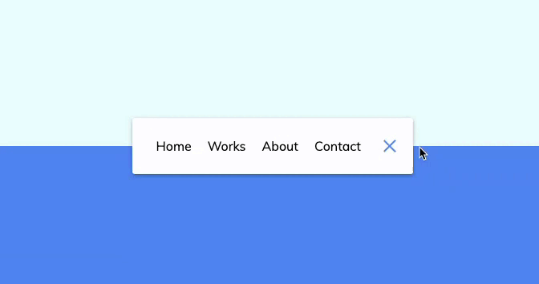

# Animated Navigation Bar

This project is a HTML, CSS, and JavaScript application that allows users to toggle the visibility of the navbar elements by clicking on the navigation button. When the button is clicked, all the navbar elements will be hidden, and when the button is clicked again, the elements will be smoothly transitioned back to the visible state.

## Installation

To run this project locally, you will need to follow these steps:

1. Clone the repository to your local machine using `git clone https://github.com/IqbalAhmadi/Animated-Navigation.git`
2. Navigate to the project directory using `cd Animated-Navigation`
3. Open the `index.html` file in your web browser to view the application.

## Usage

To use the application, follow these steps:

1. Open the `index.html` file in your web browser.
2. Click on the navigation button to toggle the visibility of the navbar elements.
3. Click on the navigation button again to smoothly transition the navbar elements back to the visible state.

## Demo

## Contributing

If you would like to contribute to the development of this project, please follow these steps:

1. Fork the repository on GitHub.
2. Create a new branch with a descriptive name using `git checkout -b branch-name`.
3. Make changes to the project and commit them using `git commit -m "Your message here"`.
4. Push the changes to your fork using `git push origin branch-name`.
5. Open a pull request on the original repository.
